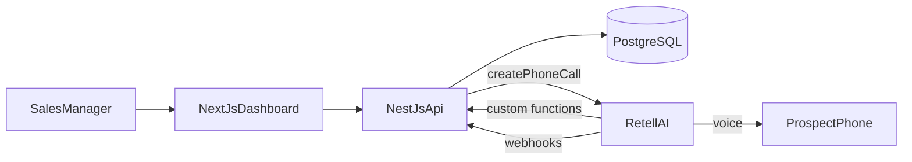
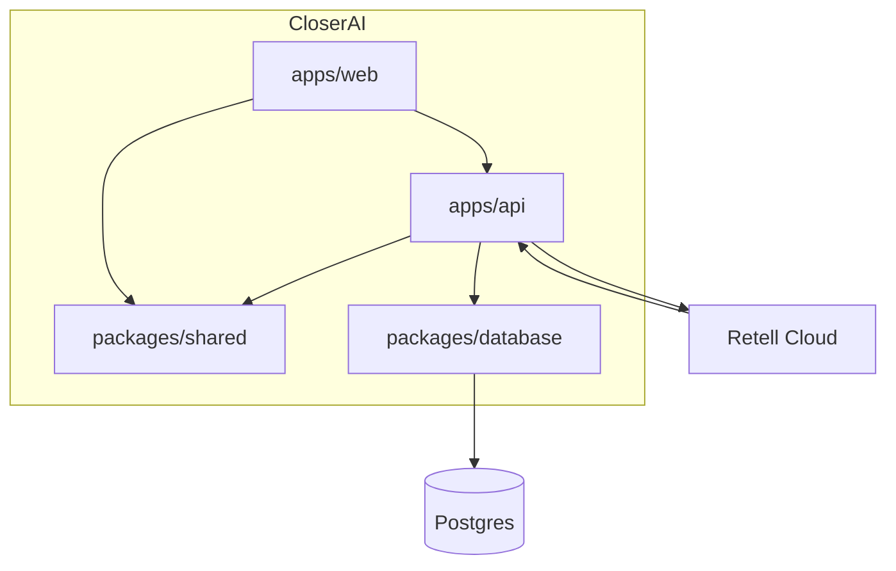
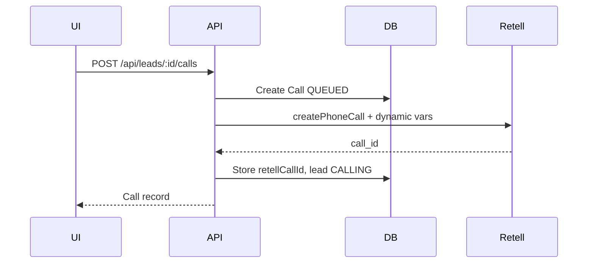
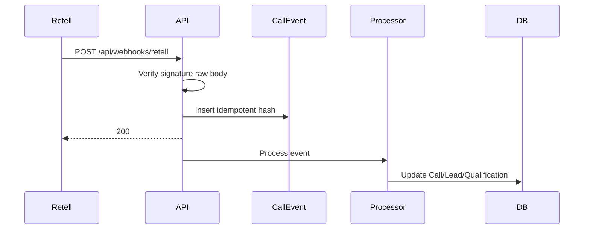
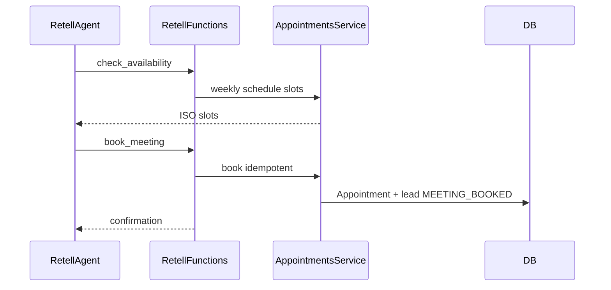

# Architecture

## System context

## Containers

## Outbound call sequence

## Webhook sequence

## Meeting booking sequence

## Security boundaries

- HTTP-only session cookies; CSRF companion cookie
- Org-scoped data access on every query
- Retell API key never exposed to the browser
- Webhook and custom-function HMAC verification on raw body
- DNC enforced in LeadsService and CallsService
- Admin-only raw payload debugging and demo simulation

## Ownership

| Concern | Owner |
|---------|-------|
| Voice, LLM reasoning, KB retrieval, ASR/TTS | Retell |
| Auth, leads, campaigns, analytics UI | CloserAI |
| Custom function business logic | CloserAI |
| Post-call structured analysis generation | Retell |
| Analysis validation & persistence | CloserAI |
